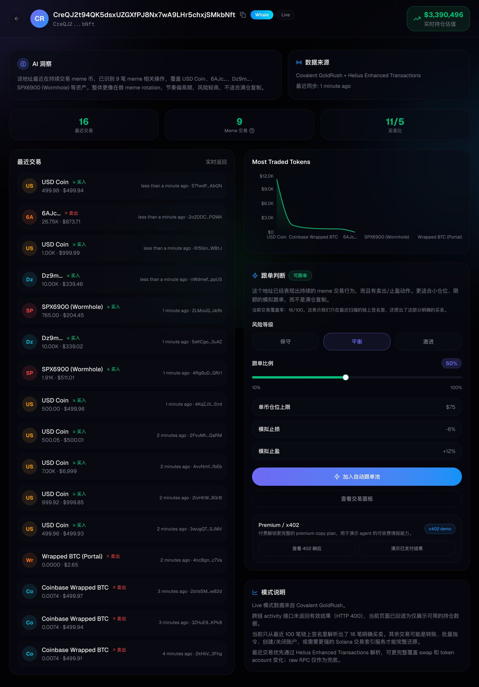
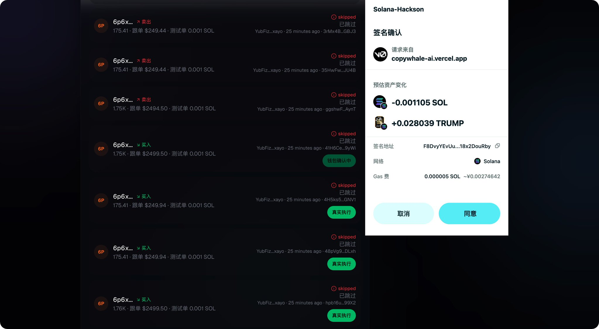
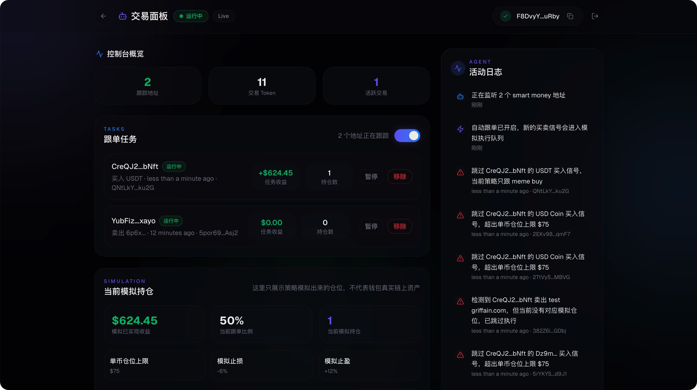
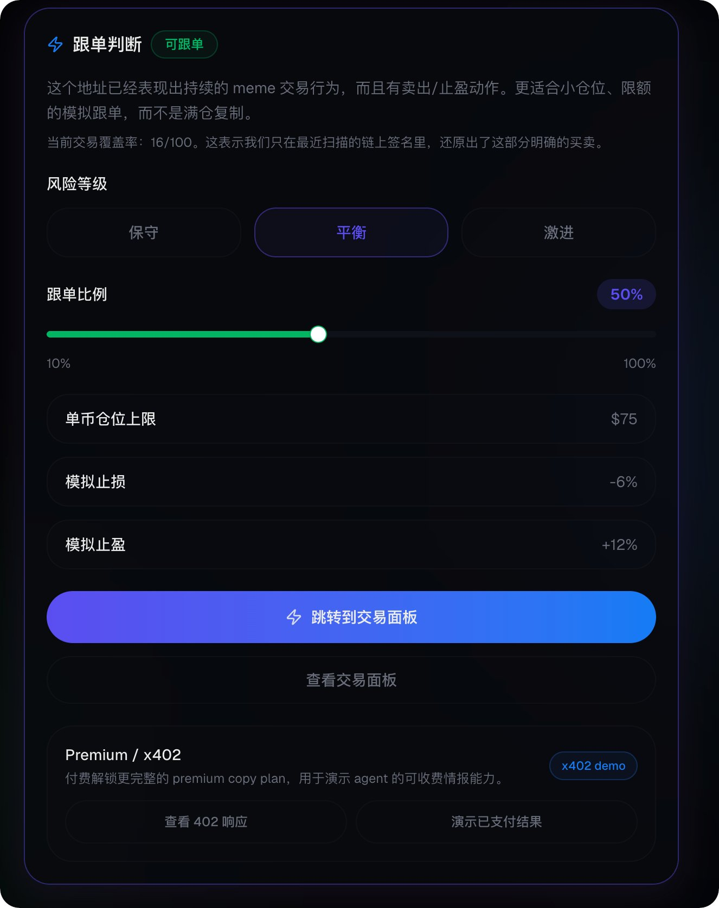
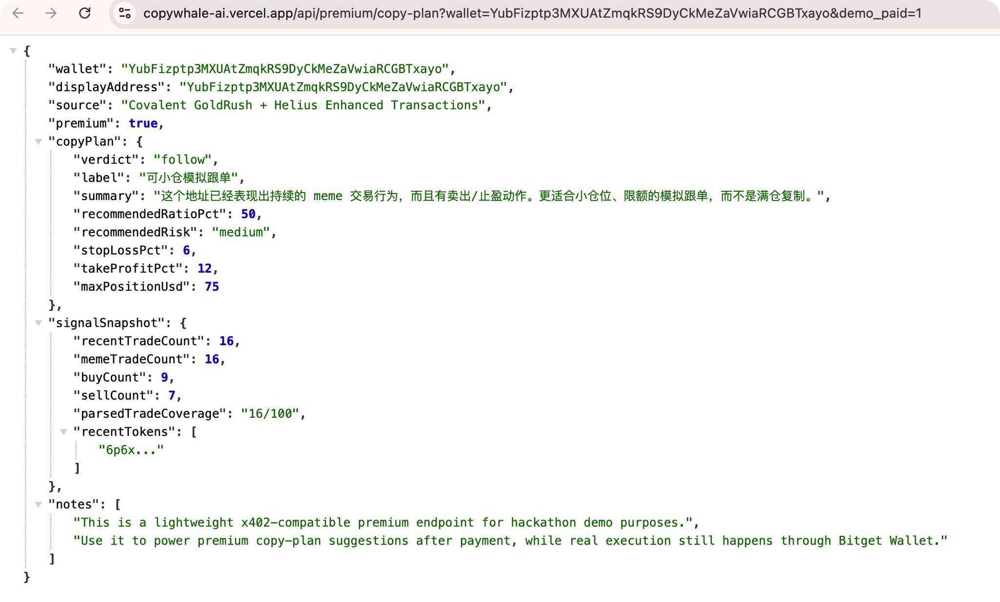

# CopyWhale AI

CopyWhale AI is a Solana meme smart-money trading agent.

It helps users:

- discover high-frequency smart-money wallets,
- reconstruct recent meme trading behavior,
- generate AI-assisted follow / watch / avoid decisions,
- simulate copy-trading strategies,
- and trigger real trade execution through Bitget Wallet.

<video src="https://youtu.be/4kDXC3ayyi8" controls width="100%" max-width="800px">
  Your browser does not support the video tag.
</video>

### [🔗](https://www.attentionvc.ai/hackathon) Solana Agent Economy Hackathon: Agent Talent Show

X: [Agent Talent Show](https://x.com/trendsdotfun/status/2037545575613428029?s=20)
Submit: [AttentionVC](https://www.attentionvc.ai/hackathon)
My X Article: [CopyWhale AI](https://x.com/DoggieKKKKKK/status/2039987901984088076?s=20)

#### Track 1: Bitget Wallet

- 💼 [Bitget Wallet](https://www.bitget.com/)：基于 Bitget 钱包技能开发 Solana 模因币 AI 交易代理

#### Track 2: Covalent GoldRush

- 🏆 [Covalent GoldRush](https://www.covalenthq.com/)：数据驱动的淘金热特工代理

## Background

In Solana meme trading, the hardest part is rarely discovering tokens. The real challenge is figuring out:

- which wallets are actually worth following,
- whether a wallet is consistently trading meme coins,
- whether it buys only or rotates and takes profit,
- and how to convert on-chain behavior into an actionable copy-trading decision.

CopyWhale AI is built to close that gap.

Instead of stopping at wallet analytics, it connects:

`wallet analysis -> AI judgment -> copy plan -> execution console -> wallet execution`

## Core Features

### 1. Wallet analysis

For a live Solana wallet, the app shows:



- recent trades,
- meme trade count,
- buy / sell ratio,
- most traded tokens,
- AI insight,
- copy-trading verdict,
- and risk-oriented follow settings.
  

### 2. Smart wallet finder

The app includes an address radar page for screening candidate wallets in batches instead of checking them one by one manually.

### 3. Copy-trading console

The trading console supports:



- follow tasks,
- simulated positions,
- on-chain execution summary,
- execution feed,
- and agent activity logs.
  

### 4. Real execution



Users can trigger a real test trade from eligible buy signals through Bitget Wallet.


### 5. Premium copy-plan API

The premium endpoint returns:

- follow verdict,
- recommended risk level,
- recommended copy ratio,
- stop loss / take profit suggestions,
- and a signal snapshot.
  
  

## Tech Stack

### Frontend / App

- Next.js 16
- React 19
- TypeScript
- Tailwind CSS
- Radix UI

### Wallet / Solana

- Bitget Wallet
- Phantom
- `@solana/web3.js`

### On-chain intelligence

- Covalent GoldRush
- Helius Enhanced Transactions
- Solana RPC fallback

### Product

- Wallet Analysis
- Copy Decision Engine
- Trading Console
- Premium API

## Project Structure

```text
app/
  api/
    premium/copy-plan/     # premium x402-style demo endpoint
    solana-swap/           # Jupiter swap preparation
    solana-broadcast/      # signed tx broadcast
    wallet-analysis/       # live wallet analysis API
  copy-trading/            # copy-trading console
  smart-wallets/           # address radar / wallet finder
  wallet/[address]/        # live wallet analysis page

components/
  wallet/                  # wallet connection and signing helpers
  ui/                      # reusable UI primitives

lib/
  wallet-analysis.ts       # Covalent / Helius / RPC analysis pipeline
  smart-wallet-finder.ts   # candidate wallet scoring

scripts/
  dev-open.mjs             # local dev auto-open helper

submission.md              # full submission narrative
submission-x-short.md      # short English submission version
x-article-cn.md            # Chinese X Article draft
demo-route-1min.md         # 1-minute demo route
final-checklist.md         # final submission checklist
```

## Local Development

### 1. Install dependencies

```bash
npm install
```

### 2. Configure environment variables

Create `.env.local`:

```bash
COVALENT_API_KEY=your_covalent_key
HELIUS_API_KEY=your_helius_key
SOLANA_RPC_URL=https://mainnet.helius-rpc.com/?api-key=your_helius_key
```

If your RPC provider requires header auth, also add:

```bash
SOLANA_RPC_API_KEY=your_rpc_key
```

### 3. Start the app

```bash
npm run dev
```

Open:

- Home: [http://localhost:3000](http://localhost:3000)
- Example premium demo:
  [http://localhost:3000/api/premium/copy-plan?wallet=&demo_paid=1](http://localhost:3000/api/premium/copy-plan?wallet=2zWkRKi5Rw15Kjx9SxhMjPY7LQTfQyr9hQKuTCGSy2FE&demo_paid=1)

## Deployment

This project is designed to deploy directly to Vercel.

Recommended environment variables for Vercel:

- `COVALENT_API_KEY`
- `HELIUS_API_KEY`
- `SOLANA_RPC_URL`
- `SOLANA_RPC_API_KEY` (only if your RPC provider needs it)

## Links

- GitHub: [https://github.com/doggiek/Solana-Agent-Economy-Hackathon_CopyWhale-AI](https://github.com/doggiek/Solana-Agent-Economy-Hackathon_CopyWhale-AI)
- Live Demo: [https://copywhale-ai.vercel.app/](https://copywhale-ai.vercel.app/)
- Premium API: `https://copywhale-ai.vercel.app/api/premium/copy-plan?wallet=xxx`
- X Article: [https://x.com/DoggieKKKKKK/status/2039987901984088076?s=20](https://x.com/DoggieKKKKKK/status/2039987901984088076?s=20)
- YouTube Demo: [https://youtu.be/4kDXC3ayyi8](https://youtu.be/4kDXC3ayyi8)
